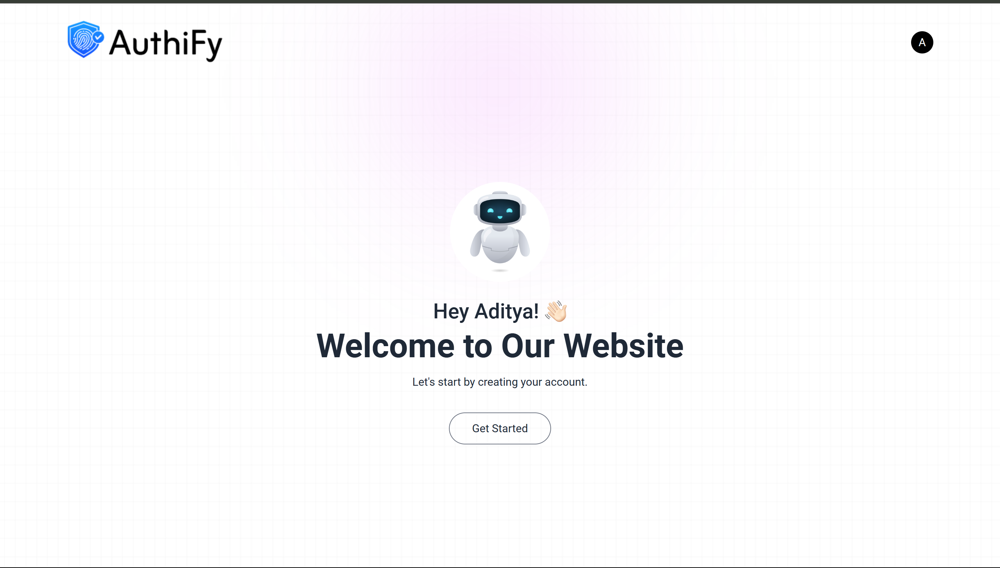
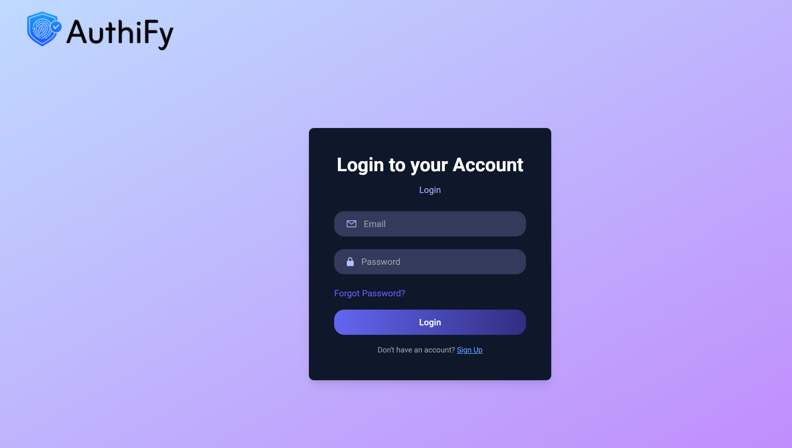
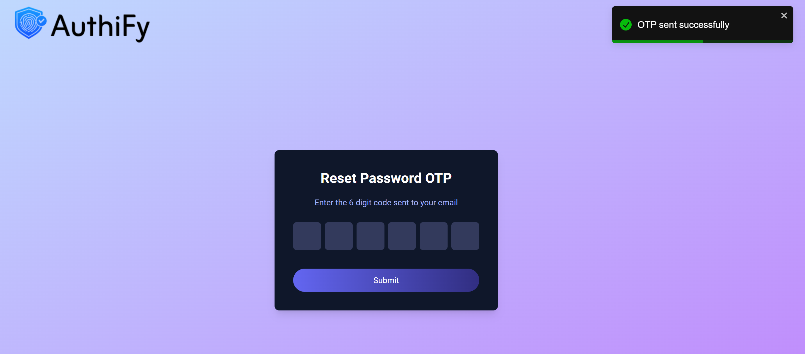
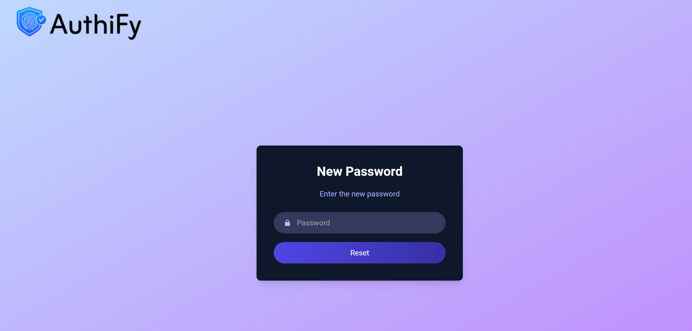

# AuthiFy

**Project Name**: AuthiFy  
**Created by**: [Aditya1or0](https://github.com/Aditya1or0)  
**Technologies**: MERN Stack (MongoDB, Express, React, Node.js), Tailwind CSS  

---

## Overview

AuthiFy is a secure authentication system built using the MERN stack and styled with Tailwind CSS. The project provides features like email verification, password reset functionality, and overall user authentication.
This app uses OTP (One-Time Password) functionality for both **email verification** and **password reset**. Users can easily reset their passwords by receiving an OTP to their registered email, ensuring a secure and smooth user experience.

---

## Features

- **User Registration**: Users can sign up with their email and password.
- **Email Verification**: After registration, users receive an OTP to their email to verify their account.
- **Password Reset**: Users can reset their password by receiving an OTP on their registered email.
- **Secure Authentication**: Utilizes JWT (JSON Web Tokens) for authentication and authorization.

---

## Technologies Used

- **Frontend**:
  - React.js
  - Tailwind CSS (for styling)
  
- **Backend**:
  - Node.js
  - Express.js
  - MongoDB (for storing user data and OTPs)
  
- **Other**:
  - Nodemailer (for sending OTPs)
  - JWT (JSON Web Tokens for authentication)
  
---

## Setup and Installation

### Prerequisites
Make sure you have the following installed on your local machine:

- **Node.js** (v14 or higher)
- **MongoDB** (local or cloud database)
- **npm** or **yarn** (for dependency management)

### Clone the Repository
```bash
git clone https://github.com/Aditya1or0/AuthiFy.git
cd AuthiFy
```

### Backend Setup

1. Navigate to the backend directory:
   ```bash
   cd backend
   ```

2. Install the dependencies:
   ```bash
   npm install
   ```

3. Configure environment variables:
   - Create a `.env` file in the `backend` directory.
   - Add the following variables:
     ```env
     MONGO_URI=<Your MongoDB URI>
     JWT_SECRET=<Your JWT Secret>
     EMAIL_HOST=<Your SMTP Host>
     EMAIL_PORT=<Your SMTP Port>
     EMAIL_USER=<Your SMTP Username>
     EMAIL_PASS=<Your SMTP Password>
     ```

4. Start the backend server:
   ```bash
   npm start
   ```

### Frontend Setup

1. Navigate to the frontend directory:
   ```bash
   cd frontend
   ```

2. Install the dependencies:
   ```bash
   npm install
   ```

3. Start the frontend server:
   ```bash
   npm start
   ```

### Access the Application

Once both the frontend and backend servers are running, you can access the app on:

- **Frontend**: [http://localhost:3000](http://localhost:3000)
- **Backend API**: [http://localhost:5173](http://localhost:5173)

---

## Functionality

### 1. **User Registration**
- The user can register with an email and password.
- After registration, an OTP will be sent to the user's email to verify their account.

### 2. **Email Verification**
- The user will receive an OTP in their email to verify their email address.
- The user can submit the OTP on the verification page to complete the process.

### 3. **Password Reset**
- If the user forgets their password, they can request a password reset.
- The system sends an OTP to the user’s registered email to verify the reset request.
- Once the OTP is verified, the user can set a new password.

### 4. **JWT Authentication**
- Upon successful login, a JWT token is generated for the user.
- The token is used to authenticate further requests, ensuring secure access to protected routes.

---

## 📸 Screenshots

### Home Page


### Login Page


### OTP Verification Page


### Password Reset Page


---

## License

This project is open source and available under the MIT License. See the [LICENSE](LICENSE) file for more details.

---

## Contributions

Contributions are welcome! Feel free to fork this repository, create an issue, or submit a pull request.


## Contact

For any inquiries or feedback, feel free to reach out to me:

- GitHub: [Aditya1or0](https://github.com/Aditya1or0)
- Email: [your-email@example.com](mailto:your-email@example.com)

---
